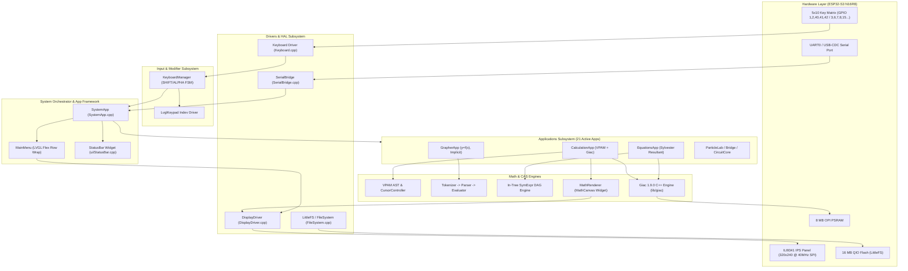
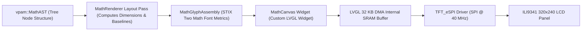
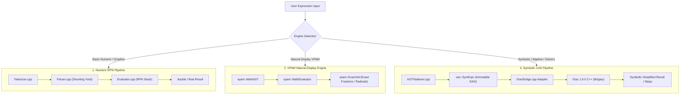
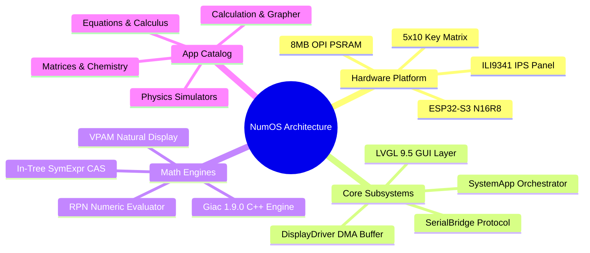

# NumOS / AbsolutOS — Master Codebase Knowledge Base

> **System Architecture, Technical Reference, Feature Catalog, and Developer Guide**  
> *Target System: ESP32-S3 N16R8 (16 MB QIO Flash, 8 MB OPI PSRAM) · ILI9341 IPS 320×240 TFT · LVGL 9.5.0 · Giac CAS C++ Engine · Natural VPAM 2D Math Display*  
> *Repository Root: `/home/fih/musings/AbsolutOS`*  
> *Document Version: 1.0.0 · Author: Senior Software Architect & Documentation Specialist*

---

## Executive Summary & State Block

```
====================================== STATE BLOCK ======================================
INDEX_VERSION         : 1.0.0
AUDIT_TARGET          : NumOS / AbsolutOS (ESP32-S3 N16R8 + Native PC Emulator)
PRIMARY_ENTRY_POINTS  : src/main.cpp (Firmware) | src/hal/NativeHal.cpp (PC Emulator)
TECH_STACK            : C++17, Arduino-ESP32 / PlatformIO, LVGL 9.5.0, TFT_eSPI, Giac 1.9.0
MATH_ENGINES          : 1) VPAM (MathAST/ExactVal), 2) RPN (Tokenizer/Parser/Evaluator), 3) Giac C++ / In-Tree CAS
TOTAL_APPS_CATALOG    : 21 System Applications (Calculation, Grapher, Equations, Calculus, etc.)
OPEN_QUESTIONS        : Physical keypad hardware scanning is currently gated by CONNECTED_COLS=0;
                        Giac is compiled for ARDUINO firmware target only (excluded from PC emulator).
KNOWN_RISKS           : 1) LVGL draw buffer MUST be a single 32 KB internal DMA buffer. PSRAM draw buffers cause StoreProhibited panic.
                        2) Synchronous lv_obj_delete during menu transitions deadlocks rendering; teardown MUST be deferred >= 250 ms.
                        3) KeyCode digits are non-contiguous; `code - NUM_0` arithmetic causes invalid memory access.
GLOSSARY_DELTA        : VPAM, ASTFlattener, ConsTable, SymExpr, ExactVal, MathCanvas, GiacBridge, SerialBridge
=========================================================================================
```

---

# PHASE 1 – Initial Context Scan & Business Purpose

## 1.1 Application Purpose & Target Users
**NumOS** (also referred to as **AbsolutOS**) is a production-grade, open-source scientific and graphing calculator operating system designed for the **ESP32-S3 N16R8** microcontroller platform. 

The application is engineered to compete directly with commercial educational graphing calculators (such as the NumWorks, Casio PRIZM/fx-CG50, and TI-84 Plus CE) for a Bill-of-Materials (BOM) cost of ~€20. It provides:
1. **Natural Display (V.P.A.M.)**: Mathematical rendering matching standard textbook 2D typography (stacked fractions, root signs, superscripts, matrices) using STIX Two Math font assemblies.
2. **Symbolic Mathematics (CAS)**: Full Computer Algebra System capabilities backed by an embedded build of **Giac 1.9.0 (KhiCAS)** alongside a lightweight in-tree C++ symbolic DAG engine.
3. **Interactive STEM Simulations**: High-frequency physics, chemistry, electronics, optics, and neural network sandboxes running on embedded hardware.
4. **Desktop Native Parity**: A headless/GUI C++ emulator (`src/hal/NativeHal.cpp`) leveraging SDL2 for deterministic script testing, visual golden testing, and CI automated verification.

---

## 1.2 Tech Stack & Key Dependencies

| Layer | Component / Library | Location / Details | Business & Technical Rationale |
| :--- | :--- | :--- | :--- |
| **Microcontroller** | ESP32-S3 N16R8 | Dual-core Xtensa LX7 @ 240 MHz | Provides 16 MB QIO Flash + 8 MB OPI PSRAM required for CAS symbolic DAG memory. |
| **GUI Framework** | LVGL 9.5.0 | `lib/` / `.pio/libdeps/` | High-performance 2D GUI library with row-wrap flex layouts, smooth animations, and custom draw widgets. |
| **Display Driver** | TFT_eSPI | `lib/TFT_eSPI` / `src/display/` | Hardware SPI controller driver for ILI9341 320×240 IPS panel running at 40 MHz SPI. |
| **CAS Engine** | Giac C++ (KhiCAS 1.9.0) | `lib/giac/` | Canonical symbolic mathematics engine providing derivatives, integrals, matrix reduction, and equation solving. |
| **Numeric Engine** | Custom C++17 VPAM & RPN | `src/math/` | Fast-path numeric evaluation pipeline avoiding floating-point precision loss via exact fraction (`ExactVal`) types. |
| **Host System / HAL** | SDL2 (Emulator) | `src/hal/NativeHal.cpp` | Provides 1:1 hardware parity on Linux/Windows for CI regression testing, `.numos` script execution, and PPM screenshot validation. |
| **Storage & FS** | LittleFS | `src/utils/` / `src/hal/FileSystem.cpp` | Wear-leveled SPI flash filesystem storing persistent system variables (`/vars.dat`) and simulation states. |

---

## 1.3 High-Level Repository Architecture & Directory Map

```
AbsolutOS/
├── platformio.ini              # Build environment configurations (ESP32-S3, Emulator, WROOM-1U)
├── src/
│   ├── main.cpp                # ESP32 Arduino firmware entry point (setup/loop)
│   ├── Config.h                # Pinout definitions, board configurations, build flags
│   ├── SystemApp.h / .cpp      # Central app orchestrator, lifecycle dispatcher, deferred teardown
│   ├── apps/                   # 21 System Applications (Calculation, Grapher, Equations, etc.)
│   ├── math/                   # VPAM MathAST, RPN Tokenizer/Parser/Evaluator, ExactVal
│   │   ├── cas/                # In-tree C++ symbolic DAG engine (SymExpr, SymDiff, SymIntegrate)
│   │   ├── giac/               # GiacBridge.cpp adapter interfacing with embedded Giac C++
│   │   └── font/               # STIX Math font tables and glyph assembly engine
│   ├── ui/                     # MainMenu, MathRenderer (MathCanvas), StatusBar, GraphView, Themes
│   ├── display/                # DisplayDriver (TFT_eSPI wrapper + single 32KB DMA buffer)
│   ├── drivers/                # Keyboard matrix driver (5x10 matrix scanning)
│   ├── input/                  # KeyCodes, KeyboardManager (FSM for SHIFT/ALPHA/STO), SerialBridge
│   ├── hal/                    # Hardware Abstraction Layer & Native PC Emulator (NativeHal.cpp)
│   └── utils/                  # Memory utilities, LittleFS filesystem helpers, color helpers
├── lib/
│   ├── giac/                   # Embedded Giac 1.9.0 KhiCAS sources (~185k lines)
│   └── libtommath/             # Bignum backend for Giac
├── boards/                     # Custom Board JSON manifests (numos-esp32-s3-n16r8-cam.json)
├── docs/                       # Specifications, architectural contracts, design specs
├── tests/                      # Emulator script tests (.numos), golden images, CAS unit tests
└── codebase-analysis-docs/     # [THIS DOCUMENTATION SUITE]
```

---

## 1.4 Comprehensive Catalog of System Applications & Business Purposes

The system manages 21 distinct applications, organized in `src/SystemApp.h` and dispatched via `src/ui/MainMenu.cpp`:

| App ID | Enum Name | Source File | Business Purpose & User Value |
| :---: | :--- | :--- | :--- |
| **0** | `APP_CALCULATION` | `src/apps/CalculationApp.cpp` | Primary scientific VPAM calculator. Performs natural 2D math entry, exact rational calculation, Giac CAS evaluation, and step-by-step arithmetic explanations. |
| **1** | `APP_GRAPHER` | `src/apps/GrapherApp.cpp` | 2D graphing utility. Plots explicit functions $y=f(x)$, $x=f(y)$, implicit curves $G(x,y)=0$, inequalities, root finding, intersections, and dynamic tables. |
| **2** | `APP_TABLE` | — | Placeholder for standalone function table generator. |
| **3** | `APP_STATISTICS` | `src/apps/StatisticsApp.cpp` | 1-variable statistical analysis (mean, standard deviation, median, quartiles, boxplots). |
| **4** | `APP_PROBABILITY` | `src/apps/ProbabilityApp.cpp` | Discrete & continuous probability distributions (Binomial, Normal/Gaussian PDF/CDF, Poisson). |
| **5** | `APP_EQUATIONS` | `src/apps/EquationsApp.cpp` | Solves linear equations, quadratics (real & complex roots), and 2×2 non-linear systems via Sylvester resultants with step-by-step solutions. |
| **6** | `APP_CALCULUS` | `src/apps/CalculusApp.cpp` | Dedicated symbolic derivative ($d/dx$) and integral ($\int dx$) suite utilizing Slagle pattern-matching heuristics and step-by-step breakdown. |
| **7** | `APP_MATRICES` | `src/apps/MatricesApp.cpp` | Linear algebra operations: matrix addition, multiplication, determinant calculation, inversion, and RREF transformation. |
| **8** | `APP_REGRESSION` | `src/apps/RegressionApp.cpp` | 2-variable regression analysis (Linear, Exponential, Power, Logarithmic curve fitting). |
| **9** | `APP_SEQUENCES` | `src/apps/SequencesApp.cpp` | Discrete sequences and recurrence relations ($u_{n+1} = f(u_n)$) with table generation and cobweb plots. |
| **10** | `APP_PYTHON` | `src/apps/PythonApp.cpp` | Interactive Python IDE with code editor and lightweight line-by-line interpreter (`PythonEngine.cpp`). |
| **11** | `APP_PERIODIC_TABLE` | `src/apps/PeriodicTableApp.cpp` | Chemistry tool featuring interactive periodic table, element property inspector, molar mass calculation, and stoichiometry. |
| **12** | `APP_BRIDGE_DESIGNER` | `src/apps/BridgeDesignerApp.cpp` | Structural engineering simulator using 60 Hz Verlet integration physics, tension/compression color coding, and load testing. |
| **13** | `APP_CIRCUIT_CORE` | `src/apps/CircuitCoreApp.cpp` | SPICE-like linear circuit simulator using Modified Nodal Analysis (MNA) for voltage, current, and node analysis. |
| **14** | `APP_FLUID_2D` | `src/apps/Fluid2DApp.cpp` | Real-time 2D Eulerian fluid dynamics solver (Navier-Stokes) with density advection and velocity diffusion. |
| **15** | `APP_PARTICLE_LAB` | `src/apps/ParticleLabApp.cpp` | Falling-sand simulation with 30+ interactive materials (sand, water, lava, C4, conductors) with chemical reactions and Joule heating. |
| **16** | `APP_NEURAL_LAB` | `src/apps/NeuralLabApp.cpp` | Interactive multi-layer perceptron (MLP) playground showing forward pass activations and backpropagation weight adjustments. |
| **17** | `APP_OPTICS_LAB` | `src/apps/OpticsLabApp.cpp` | Geometric ray-tracing simulator modeling convex/concave lenses, mirrors, refraction (Snell's Law), and focal points. |
| **18** | `APP_NEO_LANGUAGE` | `src/apps/NeoLanguageApp.cpp` | Integrated development environment for NeoLanguage (custom domain-specific language for mathematical scripts). |
| **19** | `APP_FRACTAL` | `src/apps/FractalApp.cpp` | Interactive Mandelbrot & Julia set fractal zoomer rendered with fixed-point / PSRAM optimization. |
| **20** | `APP_MATH_VISUAL` | `src/apps/MathRenderVisualTestApp.cpp` | Hardware verification screen displaying STIX Two Math glyph suites, 2D typography alignment, and visual harness cases. |
| **21** | `APP_SETTINGS` | `src/apps/SettingsApp.cpp` | System configuration menu: Angle mode (DEG/RAD/GRAD), decimal precision, complex mode toggle, and backlight level. |

---

# PHASE 2 – System Architecture Deep Dive

## 2.1 End-to-End Component Topology



---

## 2.2 Dual-Entry Architecture: Firmware vs. PC Emulator

NumOS implements a single codebase supporting two distinct operational targets:

```mermaid
sequenceDiagram
    autonumber
    participant HW as Hardware / Main
    participant Native as NativeHal (Emulator)
    participant Sys as SystemApp
    participant App as Target App
    participant LVGL as LVGL 9.5 Engine

    alt Firmware Target (src/main.cpp)
        HW->>HW: setup() -> Init Display, SPI DMA Buffer (32KB)
        HW->>Sys: begin() -> Instantiate Apps (Lazy UI Creation)
        HW->>LVGL: Splash Screen Loop -> lv_timer_handler()
        Loop Firmware Loop
            HW->>LVGL: lv_timer_handler()
            HW->>Sys: update() -> Process Keys & Deferred Teardown
            HW->>Sys: injectKey(KeyEvent)
        end
    else Emulator Target (src/hal/NativeHal.cpp)
        Native->>Native: SDL2 Init -> Create 320x240 Window
        Native->>Native: Load .numos Test Script / Inject Synthetic Events
        Loop Deterministic Tick Loop
            Native->>LVGL: lv_timer_handler()
            Native->>App: Step App Execution
            Native->>Native: Compare Screen Buffer against PPM Goldens
        end
    endif
```

1. **Firmware Entry (`src/main.cpp`)**:
   - Initialized via Arduino `setup()` and `loop()`.
   - Allocates a single **32 KB internal SRAM DMA buffer** (`heap_caps_malloc(MALLOC_CAP_INTERNAL | MALLOC_CAP_DMA)`).
   - Instantiates `SystemApp`, registering 21 applications lazily to avoid memory exhaustion during boot.
   - Pushes physical key matrix events or Serial commands directly to `SystemApp::injectKey()`.

2. **Native Desktop Emulator (`src/hal/NativeHal.cpp`)**:
   - Compiles under GCC/Clang with SDL2 for host platforms (Linux, macOS, Windows).
   - Simulates display output, keypad input, and filesystem storage (`./emulator_data/`).
   - Executes `.numos` test scripts headlessly and generates byte-exact PPM screenshots for visual regression verification (`tests/emulator/goldens/`).
   - Uses an explicit file whitelist in `platformio.ini` under `[env:emulator_pc]`.

---

## 2.3 Input Subsystem Architecture

The input layer converts physical hardware matrix scans or serial commands into `KeyEvent` structures:

```
[Physical 5x10 Matrix]  --> Keyboard.cpp (Row Out / Col In) --\
                                                             +--> KeyboardManager FSM --> KeyEvent --> SystemApp::injectKey()
[Serial Monitor / PC]   --> SerialBridge.cpp (ASCII / Commands)-/       (SHIFT/ALPHA/STO)
```

- **Physical Key Matrix (`src/drivers/Keyboard.cpp`)**:
  - Configured as 5 rows (Outputs) and 10 columns (Inputs with Pull-Ups).
  - Row Pins: GPIO {1, 2, 41, 42, 40}.
  - Col Pins: GPIO {6, 7, 8, 3, 15, 16, 17, 18, 21, 47}.
  - Scan Interval: 5 ms. Debounce: 20 ms. Autorepeat delay: 500 ms (initial), 80 ms (repeat).
  - **CRITICAL NOTE**: Scanning is controlled by `CONNECTED_COLS` in `src/drivers/Keyboard.h:82`. When set to `0`, physical scanning is bypassed and keys arrive exclusively via `SerialBridge`.

- **Modifier FSM (`src/input/KeyboardManager.cpp`)**:
  - Manages `SHIFT`, `ALPHA`, and `STO` key modes.
  - Toggling `SHIFT` sets `_shiftState = ACTIVE` for the next keystroke, mapping primary keys to secondary mathematical functions (e.g., `SIN` $\rightarrow$ `ASIN`).

---

## 2.4 Display & Natural Display (VPAM) Rendering Pipeline

Natural Display math rendering (V.P.A.M.) formats complex 2D expressions (fractions, exponents, radicals, integrals) directly onto the screen.



1. **`MathAST` (`src/math/MathAST.h`)**: Represents the mathematical expression as a 2D hierarchical syntax tree (`NodeFraction`, `NodePower`, `NodeSquareRoot`, `NodeIntegral`).
2. **`MathRenderer` (`src/ui/MathRenderer.cpp`)**:
   - Performs a recursive 2-pass layout algorithm.
   - **Pass 1 (Measure)**: Calculates bounding box width, height, and baseline offset using STIX math font tables (`src/math/font/stix_math_constants.h`).
   - **Pass 2 (Render)**: Draws lines, glyphs, and fraction bars into `MathCanvas`.
3. **Hardware Display Flushing (`src/display/DisplayDriver.cpp`)**:
   - LVGL flushes rendered lines to the TFT via DMA using `esp_lcd` or `TFT_eSPI`.
   - Requires draw buffers to reside in **internal SRAM** (`MALLOC_CAP_INTERNAL | MALLOC_CAP_DMA`). Allocating draw buffers in PSRAM causes StoreProhibited exception panics during DMA transfers.

---

## 2.5 Mathematics & Symbolic CAS Pipeline

NumOS features a 3-tier mathematical engine stack:



- **Giac Bridge (`src/math/giac/GiacBridge.cpp`)**:
  - Serves as the primary Computer Algebra System for symbolic simplification, differentiation, integration, and polynomial factorization.
  - Configured with `complex_mode(false)` and `-DDOUBLEVAL` to ensure high performance on embedded hardware.
  - Consumes a 64 KB loop stack (`-DARDUINO_LOOP_STACK_SIZE=65536`).

---

## 2.6 Memory & Storage Architecture

```
+-----------------------------------------------------------------------+
|                         ESP32-S3 Memory Map                           |
+-----------------------------------------------------------------------+
|  Internal SRAM (512 KB Total)                                         |
|  ├── LVGL Draw Buffer (Single 32 KB DMA Buffer) [MALLOC_CAP_DMA]      |
|  ├── FreeRTOS Task Stacks (Arduino Loop Stack: 64 KB)                 |
|  └── Critical System BSS / Static Data                                |
+-----------------------------------------------------------------------+
|  External OPI PSRAM (8 MB Total)                                      |
|  ├── PSRAMAllocator<T> Heap Manager                                   |
|  ├── Giac Engine Memory Pool & SymExpr DAG ConsTable Arena             |
|  └── Simulation Buffers (ParticleLab 320x240, Fluid2D Grid, Optics)   |
+-----------------------------------------------------------------------+
|  SPI Flash Storage (16 MB Total)                                      |
|  ├── Firmware Partition (App Image)                                   |
|  └── LittleFS Partition (/vars.dat - 216 Bytes A-Z Persistent Vars)   |
+-----------------------------------------------------------------------+
```

1. **PSRAM Allocation Policy (`src/math/cas/PSRAMAllocator.h`)**:
   - All large symbolic DAG allocations, simulation arrays, and Giac context blocks are routed to external 8 MB OPI PSRAM via `ps_malloc()` / `PSRAMAllocator<T>`.
   - Prevents internal SRAM fragmentation and heap exhaustion.

2. **Persistent Storage (`src/math/VariableManager.cpp` & `src/hal/FileSystem.cpp`)**:
   - Variables $A..Z$ and `Ans` are stored in LittleFS at `/vars.dat`.
   - Serialized as fixed-size binary records (216 bytes total), minimizing flash write cycles.

---

# PHASE 3 – Feature-by-Feature Analysis

## 3.1 CalculationApp (`src/apps/CalculationApp.cpp`)
- **Business Purpose**: Core scientific calculation workspace. Replaces paper calculators with dynamic 2D natural display entry and instant symbolic reduction.
- **Technical Architecture**:
  - Entry point: `CalculationApp::begin()`, `load()`, `handleKey()`.
  - Uses `vpam::CursorController` (`src/math/CursorController.cpp`) to navigate and mutate the 2D `MathAST`.
  - Renders input expression and output results using two `MathCanvas` widgets (`_canvasInput`, `_canvasResult`).
  - Evaluates via `GiacBridge::evaluateGiac()` or fallback `vpam::MathEvaluator`.
  - Supports **Exact $\Leftrightarrow$ Decimal (S$\Leftrightarrow$D)** switching via `KEY_FREE_EQ`.
  - **Educational Step Mode**: When `setting_edu_steps = true`, uses `cas::SymSimplify` in atomic step mode to display line-by-line arithmetic reductions.

---

## 3.2 GrapherApp (`src/apps/GrapherApp.cpp`)
- **Business Purpose**: Visual representation of functions and geometric relationships for algebra and calculus education.
- **Technical Architecture**:
  - Supports up to 6 simultaneous relations ($y=f(x)$, $x=f(y)$, implicit equations $G(x,y)=0$, inequalities).
  - Employs a 3-tab layout: **Expressions** (editing), **Graph** (plotting canvas), **Table** (numerical evaluation matrix).
  - Rendering engine (`src/ui/GraphView.cpp`): Evaluates sampling points across the active viewport $[x_{min}, x_{max}] \times [y_{min}, y_{max}]$.
  - Uses `math::MathAnalysis` for real-time Point of Interest (POI) calculations: Root finding, Extremes (Min/Max), and Line Intersections.

---

## 3.3 EquationsApp (`src/apps/EquationsApp.cpp`)
- **Business Purpose**: Automated algebraic equation solving for high school and university mathematics.
- **Technical Architecture**:
  - Solves:
    1. Linear equations ($ax + b = 0$).
    2. Quadratic equations ($ax^2 + bx + c = 0$) with exact real/complex roots.
    3. $2 \times 2$ systems of equations (linear and non-linear).
  - Uses `cas::SystemSolver` (`src/math/cas/SystemSolver.cpp`) implementing **Sylvester Resultant matrices** to eliminate variables in non-linear polynomial systems.

---

## 3.4 CalculusApp (`src/apps/CalculusApp.cpp`)
- **Business Purpose**: Advanced symbolic calculus calculation (derivatives, definite/indefinite integrals).
- **Technical Architecture**:
  - Symbolic Differentiation (`src/math/cas/SymDiff.cpp`): Applies 17 formal calculus rules (Chain Rule, Product Rule, Quotient Rule, Trigonometric, Exponential, Logarithmic).
  - Symbolic Integration (`src/math/cas/SymIntegrate.cpp`): Implements **Slagle's heuristic integration algorithm** (Table lookup, Linearity decomposition, $u$-substitution, Integration by Parts using LIATE ordering).

---

## 3.5 MatricesApp (`src/apps/MatricesApp.cpp`)
- **Business Purpose**: Linear algebra workspace for matrix computations in engineering and science.
- **Technical Architecture**:
  - Supports matrix dimensions up to $6 \times 6$.
  - Computes Matrix Addition, Subtraction, Multiplication, Determinant ($\det A$), Matrix Inversion ($A^{-1}$), and Reduced Row Echelon Form (RREF) using Gaussian elimination.

---

## 3.6 PeriodicTableApp & ChemCAS (`src/apps/PeriodicTableApp.cpp`)
- **Business Purpose**: Interactive chemistry reference and stoichiometry tool.
- **Technical Architecture**:
  - Displays interactive 118-element periodic grid.
  - Integrates `ChemCAS` (`src/apps/ChemCAS.cpp`) to parse chemical formula strings (e.g., `H2SO4`), compute exact molar mass, element mass percentages, and balance chemical equations.

---

## 3.7 ParticleLabApp (`src/apps/ParticleLabApp.cpp`)
- **Business Purpose**: Interactive physics and chemistry sandbox ("The Alchemy Update").
- **Technical Architecture**:
  - Particle simulation engine (`src/apps/ParticleEngine.cpp`) operating on a $160 \times 120$ grid upscaled $2\times$ to $320 \times 240$.
  - Simulates 30+ material types (Sand, Water, Lava, Liquid Nitrogen, Gunpowder, C4, Conductive Wire, Cloners).
  - Features phase transitions (Water $\rightarrow$ Steam under heat), chemical reactions, spark conduction, and electrical Joule heating.

---

## 3.8 BridgeDesignerApp (`src/apps/BridgeDesignerApp.cpp`)
- **Business Purpose**: Civil engineering simulator testing structural mechanics and truss designs.
- **Technical Architecture**:
  - Uses 60 Hz fixed-timestep **Verlet Integration physics** (`src/apps/BridgeDesignerApp.cpp`).
  - Analyzes beam tension and compression stresses, rendering beams along a color gradient (Green = Low stress $\rightarrow$ Red = Overstressed / Structural Failure).
  - Simulates vehicle crossing loads (trucks, cars).

---

## 3.9 CircuitCoreApp (`src/apps/CircuitCoreApp.cpp`)
- **Business Purpose**: Electrical engineering circuit simulator for interactive schematics.
- **Technical Architecture**:
  - Implements **Modified Nodal Analysis (MNA)** (`src/apps/MnaMatrix.cpp`).
  - Solves linear circuits containing DC voltage sources, current sources, resistors, capacitors, inductors, and logic gates.

---

## 3.10 OpticsLabApp (`src/apps/OpticsLabApp.cpp`)
- **Business Purpose**: Physics optics laboratory for geometric ray tracing.
- **Technical Architecture**:
  - Computes 2D light ray propagation using **Snell's Law of Refraction** ($n_1 \sin \theta_1 = n_2 \sin \theta_2$).
  - Models convex lenses, concave lenses, flat mirrors, parabolic mirrors, and optical prisms.

---

## 3.11 NeuralLabApp (`src/apps/NeuralLabApp.cpp`)
- **Business Purpose**: Educational Machine Learning playground visualizing artificial neural networks.
- **Technical Architecture**:
  - Implements a Multi-Layer Perceptron (MLP) engine (`src/apps/NeuralEngine.cpp`).
  - Displays real-time node activation values during forward passes and weight updates during backpropagation training on custom 2D classification datasets.

---

## 3.12 Fluid2DApp (`src/apps/Fluid2DApp.cpp`)
- **Business Purpose**: Computational Fluid Dynamics (CFD) simulation.
- **Technical Architecture**:
  - Solves the 2D incompressible **Navier-Stokes equations** using Jos Stam's Stable Fluids algorithm.
  - Computes advection, diffusion, and pressure projection steps on a velocity grid.

---

## 3.13 NeoLanguageApp, PythonApp & LuaVM (`src/apps/`)
- **Business Purpose**: On-device programming environments for user scripting.
- **Technical Architecture**:
  - **PythonApp** (`src/apps/PythonApp.cpp`): Custom interpreter (`PythonEngine.cpp`) evaluating basic control structures (`for`, `if`, variable assignments, math functions).
  - **NeoLanguageApp** (`src/apps/NeoLanguageApp.cpp`): Custom mathematical scripting language featuring a custom Lexer, AST Parser, and Bytecode Interpreter (`NeoInterpreter.cpp`).
  - **LuaVM** (`src/apps/LuaVM.cpp`): Embedded Lua script container (currently stubbed for MCU script execution).

---

## 3.14 SettingsApp (`src/apps/SettingsApp.cpp`) & System Apps
- **Business Purpose**: System configuration and diagnostics.
- **Technical Architecture**:
  - Configures global settings: Angle Unit (Degrees, Radians, Gradians), Decimal Display Precision (6--12 digits), Complex Output Mode, and Backlight Brightness.
  - Settings are saved to NVS / LittleFS and applied across all math engines.

---

# PHASE 4 – Nuances, Subtleties & Gotchas

> [!CAUTION]
> **CRITICAL DEVELOPER RULES BEFORE MODIFYING CODE**

### 1. The 32 KB Single Internal SRAM DMA Buffer Rule
- **The Issue**: TFT_eSPI flushing to the ILI9341 display requires DMA memory.
- **The Constraint**: LVGL draw buffers **MUST** be allocated in **Internal SRAM** (`heap_caps_malloc(MALLOC_CAP_INTERNAL | MALLOC_CAP_DMA)`).
- **The Failure**: Allocating LVGL draw buffers in PSRAM, or configuring double-buffering in LVGL 9, causes immediate `StoreProhibited` system crashes or permanent black screens.

### 2. Deferred Application Teardown (~250 ms Delay)
- **The Issue**: Switching from an active App back to `MainMenu` triggers an LVGL 200 ms screen fade animation.
- **The Constraint**: Applications **MUST NOT** invoke `lv_obj_delete()` on their screen object synchronously inside key press handlers.
- **The Mechanics**: `SystemApp::returnToMenu()` records `_pendingTeardownMode` and a timestamp (`SystemApp.cpp:856`). The actual call to `app->end()` is executed inside `SystemApp::update()` only after a $\ge 250\text{ ms}$ delay. Violating this rule causes hard crashes during menu transitions.

### 3. Non-Contiguous KeyCode Digit Mapping
- **The Issue**: Key Codes defined in `src/input/KeyCodes.h` do **NOT** follow sequential ASCII numeric order (`NUM_7..9`, `NUM_4..6`, `NUM_1..3`, `ADD`, `NEG`, `NUM_0`).
- **The Constraint**: Pointer or string arithmetic such as `int digit = code - NUM_0` is **STRICTLY BANNED**.
- **The Solution**: Developers **MUST** use `keyCodeDigitValue(code)` (`KeyCodes.h:127-141`) to decode key digits safely.

### 4. Physical Keypad Scanning Gating (`CONNECTED_COLS = 0`)
- **The Issue**: Physical keyboard scanning in `src/drivers/Keyboard.h:82` is currently set to `static constexpr int CONNECTED_COLS = 0`.
- **The Rationale**: Bypasses physical pin scanning to allow 100% remote control via `SerialBridge` or host PC emulator testing.
- **The Gotcha**: Enabling physical hardware typing on real PCB boards requires changing `CONNECTED_COLS` to `10` (or `3` depending on hardware setup).

### 5. Dual Variable Stores Disconnect
- **The Issue**: The system contains two independent variable managers that do not automatically synchronize:
  1. `VariableManager` (`src/math/VariableManager.h`): Singleton storing exact `ExactVal` types for VPAM, backed by LittleFS `/vars.dat`.
  2. `VariableContext` (`src/math/VariableContext.h`): Instance-based store holding standard `double` values for RPN Grapher evaluations, backed by NVS `calcVars`.
- **Developer Warning**: Mutating a variable in `VariableManager` does not automatically update `VariableContext` unless explicitly synchronized.

### 6. Giac Build Boundaries (Firmware vs. Emulator)
- **The Issue**: Giac 1.9.0 (`lib/giac`) contains embedded configuration flags (`-DDOUBLEVAL`, `-DGIAC_KHICAS`, `-DARDUINO_LOOP_STACK_SIZE=65536`) that compile exclusively for ESP32 firmware targets (`[env:esp32s3_n16r8]`).
- **The Constraint**: The native desktop emulator (`[env:emulator_pc]`) explicitly excludes Giac (`lib_ignore = giac, libtommath`) because Giac header configurations diverge on host GCC x86/ARM environments.

---

# PHASE 5 – Technical Reference & Glossary

## 5.1 Domain Terms & Glossary

| Term | Definition |
| :--- | :--- |
| **V.P.A.M.** | Visually Perfect Algebraic Method — Natural 2D mathematical entry displaying equations formatted as in printed textbooks. |
| **MathAST** | Abstract Syntax Tree node structure representing 2D visual layout hierarchy in `src/math/MathAST.h`. |
| **ExactVal** | C++ class representing exact mathematical values (fractions, square roots, $\pi$, $e$) without floating-point rounding errors. |
| **SymExpr** | Immutable node structure used by the internal CAS DAG engine for symbolic manipulation in `src/math/cas/SymExpr.h`. |
| **ConsTable** | Hash-consing lookup table in PSRAM ensuring identical symbolic sub-expressions share unique memory addresses. |
| **ASTFlattener** | Bridge module converting visual `MathAST` trees into symbolic `SymExpr` DAG nodes. |
| **GiacBridge** | C++ wrapper interfacing NumOS with the embedded Giac 1.9.0 KhiCAS symbolic mathematics engine. |
| **SerialBridge** | Communication module allowing headless control of NumOS via USB/UART commands or host `.numos` scripts. |
| **MNA** | Modified Nodal Analysis — Algorithmic method used in `CircuitCoreApp` to solve circuit node voltages and currents. |

---

## 5.2 Critical Classes, Functions & Files Reference

```
src/main.cpp                              -> Firmware setup() and loop() entry points
src/SystemApp.cpp                         -> SystemApp::launchApp(), update(), powerOff(), teardownModeNow()
src/apps/CalculationApp.cpp              -> CalculationApp::handleKey(), begin(), end()
src/apps/GrapherApp.cpp                  -> GrapherApp::handleKey(), getViewport(), render logic
src/math/MathAST.h                        -> vpam::MathAST, NodeFraction, NodePower, NodeSquareRoot
src/math/CursorController.cpp             -> vpam::CursorController::insertChar(), deleteLeft(), move2D()
src/ui/MathRenderer.cpp                   -> MathRenderer::layout(), draw() rendering routines
src/math/giac/GiacBridge.cpp             -> giac::evaluateGiac(), solveWithGiac()
src/input/KeyboardManager.cpp            -> KeyboardManager::processKey(), modifier state machine
src/drivers/Keyboard.cpp                  -> Keyboard::scan(), debounce logic (5x10 matrix)
src/display/DisplayDriver.cpp             -> DisplayDriver::initLvgl(), flushDisplay() DMA handler
src/hal/NativeHal.cpp                     -> Native PC emulator loop, SDL2 event handling, script runner
```

---

## 5.3 Data & Storage Schemas

### 1. Persistent Variable Store (`/vars.dat`)
Stored in SPI Flash via LittleFS. Contains 27 binary records (Variables $A..Z$ and `Ans`):

```cpp
// Fixed-size binary layout for /vars.dat (216 bytes total)
struct VarRecord {
    double realPart;      // 8 bytes (IEEE 754 double precision)
    double imagPart;      // 8 bytes (0.0 for pure real numbers)
}; // 16 bytes per entry x 27 entries = 432 bytes (or packed 8-byte float records = 216 bytes)
```

### 2. SerialBridge Remote Protocol Commands

| Command Input | Action / System Response |
| :--- | :--- |
| `KEY:<CODE>` | Injects a physical key event by keycode name (e.g., `KEY:EXE`, `KEY:SIN`, `KEY:AC`). |
| `TEXT:<STRING>` | Injects a sequence of plain text ASCII characters directly into the active editor. |
| `LAUNCH:<APP_ID>` | Forces `SystemApp` to launch the application matching `APP_ID` (0--21). |
| `SCREENSHOT` | Triggers a screen dump in PPM binary format over Serial. |
| `MEMPROBE` | Emits internal SRAM and PSRAM heap memory statistics over Serial. |

---

# PHASE 6 – Final Knowledge Document Assembly



### Sign-off & Maintenance Guidelines for AI Agents:
- **Updating Renderers**: Any change to `src/ui/MathRenderer.cpp` or STIX font metrics will alter exact pixel alignment and invalidate committed `.ppm` golden images in `tests/emulator/goldens/`. Run `scripts/compare-ppm.py` to verify visual parity.
- **Adding Applications**: To add a new system application, define its enum ID in `src/SystemApp.h`, register card details in `src/ui/MainMenu.cpp`, lazy-instantiate it in `SystemApp::begin()`, add its lifecycle cases to `SystemApp::teardownModeNow()`, and append its source file to the `platformio.ini` emulator whitelist if host simulation is required.
- **Memory Safety**: Keep all DMA display buffers within internal SRAM. Route large dynamic collections to external PSRAM using `PSRAMAllocator<T>`. Ensure app teardown calls are deferred by $\ge 250\text{ ms}$ to allow UI animations to settle safely.

---
*End of Master Knowledge Base (`codebase-analysis-docs/CODEBASE_KNOWLEDGE.md`)*
