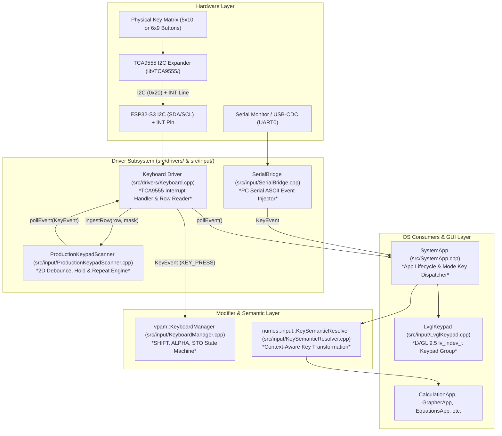
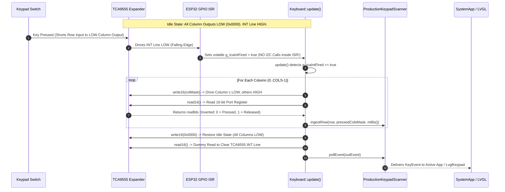

# NumOS Input Stack Architecture & TCA9555 I2C Keypad Driver Specification

> **Architectural Breakdown & Implementation Guide for AI Coding Agents**  
> *Target Goal: Implement an interrupt-driven TCA9555 I2C Keypad Matrix Driver in `src/drivers/Keyboard.cpp` with zero breaking changes to downstream OS applications.*  
> *Target Hardware: ESP32-S3 N16R8 + TCA9555 16-Channel I2C GPIO Expander (`lib/TCA9555/`)*  
> *Document Version: 1.0.0 · Author: Senior Software Architect & Documentation Specialist*

---

## 1. Executive Summary & Design Principles

The NumOS input system processes keystrokes from physical hardware matrixes, PC serial bridges, and desktop emulator inputs, normalizing them into `KeyEvent` structures for UI consumption.

Currently, physical matrix scanning in `src/drivers/Keyboard.h` is gated by `CONNECTED_COLS = 0` (bypassing direct GPIO polling). Migrating to a **TCA9555 I2C GPIO Expander** allows NumOS to offload 15+ keyboard pins to a single I2C bus (`SDA`/`SCL`) plus a single falling-edge interrupt pin (`INT`).

### Core Design Principles for Implementation:
1. **Zero Downstream Modifications**: `SystemApp`, `KeyboardManager`, `LvglKeypad`, `SerialBridge`, and individual Applications **must not require any code changes**. `Keyboard::pollEvent()` remains the canonical contract.
2. **Interrupt-Driven (Zero I2C Polling Overhead)**: In idle state, all matrix columns are driven **LOW**. When any key is pressed, the hardware shorts an input row to a LOW column, pulling the row LOW and triggering the TCA9555 `INT` pin. I2C bus transactions occur **only** when an interrupt fires or when debouncing/holding keys.
3. **No I2C inside Hardware ISRs**: The GPIO ISR sets a volatile flag or signals a FreeRTOS notification. Full I2C register reads/writes are deferred to `Keyboard::update()` running in the main task loop.
4. **Integration with `ProductionKeypadScanner`**: Raw row bitmasks read over I2C are fed directly into `numos::input::ProductionKeypadScanner::ingestRow()`, maintaining existing 2D debounce, holding, auto-repeat, and queue overflow protection.

---

## 2. Input Stack Architectural Hierarchy



---

## 3. Existing Class Contracts & API Breakdown

### 3.1 `Keyboard` Driver (`src/drivers/Keyboard.h` & `src/drivers/Keyboard.cpp`)
- **Role**: Primary interface between physical hardware and NumOS.
- **Public API**:
  - `void begin()`: Initializes I2C bus, TCA9555 registers, and GPIO interrupt pin.
  - `void update()`: Called every frame/loop iteration. Checks interrupt flag, performs column scanning if active, and updates `_productionScanner`.
  - `bool pollEvent(KeyEvent& outEvent)`: Dequeues the next processed `KeyEvent` from `_productionScanner`. Returns `true` if an event was popped.
  - `void forceReleaseAll()`: Immediately flushes held keys during application switches.
- **Private Data Members**:
  - `numos::input::ProductionKeypadScanner _productionScanner`: Owns the 2D debouncing queue.

### 3.2 `ProductionKeypadScanner` (`src/input/ProductionKeypadScanner.h`)
- **Role**: State-machine managing row bitmask debouncing, press/release logic, hold detection, and key repetition.
- **Key Function**:
  ```cpp
  void ingestRow(uint8_t row, uint16_t pressedColumnsBitmask, uint32_t nowMs);
  ```
  - `row`: Row index ($0 \dots \text{ROWS}-1$).
  - `pressedColumnsBitmask`: 16-bit field where **Bit $c = 1$ means Column $c$ is pressed**.
  - `nowMs`: Timestamp from `millis()`.

### 3.3 `TCA9555` Library (`lib/TCA9555/TCA9555.h`)
- **Role**: Official Rob Tillaart I2C expansion library included in `lib/TCA9555/`.
- **Key Methods**:
  - `TCA9555(uint8_t address, TwoWire *wire = &Wire)`: Constructor (default I2C address `0x20`).
  - `bool begin()`: Initializes Wire transmission.
  - `bool pinMode16(uint16_t mask)`: Sets pin directions for all 16 pins simultaneously (`1` = INPUT, `0` = OUTPUT).
  - `bool write16(uint16_t mask)`: Sets 16-bit output states across Port 0 (`P00-P07`) and Port 1 (`P10-P17`).
  - `uint16_t read16()`: Reads all 16 input/output pin states in a single 2-byte I2C transaction. Reading clears the TCA9555 `INT` pin.

---

## 4. TCA9555 Hardware Contract & Pin Topology

### 4.1 Pin Mapping Options

#### Option A: Standard 5 Rows × 10 Columns Matrix (15 Pins Total)
- **Port 0 Pins `P00` to `P04` (5 Pins)**: Configured as **INPUTS** (Matrix Rows $0 \dots 4$).
- **Port 0 Pin `P05` & Port 1 Pins `P10` to `P17` & `P06` (10 Pins)**: Configured as **OUTPUTS** (Matrix Columns $0 \dots 9$).
- **Bitmask Config**: `pinMode16(0x001F)` ($\text{Bits } 0..4 = 1 \text{ [INPUT]}, \text{Bits } 5..15 = 0 \text{ [OUTPUT]}$).

#### Option B: Extended 6 Rows × 9 Columns Matrix (15 Pins Total)
- **Port 0 Pins `P00` to `P05` (6 Pins)**: Configured as **INPUTS** (Matrix Rows $0 \dots 5$).
- **Port 0 Pins `P06-P07` & Port 1 Pins `P10-P16` (9 Pins)**: Configured as **OUTPUTS** (Matrix Columns $0 \dots 8$).
- **Bitmask Config**: `pinMode16(0x003F)` ($\text{Bits } 0..5 = 1 \text{ [INPUT]}, \text{Bits } 6..15 = 0 \text{ [OUTPUT]}$).

```
          TCA9555 16-Bit I2C Expander (Address 0x20)
     +---------------------------------------------------+
     | P00..P04 : Rows 0..4   (Inputs w/ Pull-ups)       | <=== [Keyboard Matrix Rows]
     | P05,P06,P07,P10..P16 : Cols 0..9 (Outputs)         | ===> [Keyboard Matrix Cols]
     | INT Pin  : Active-LOW Open-Drain Interrupt        | ---> ESP32 GPIO 4 (FALLING ISR)
     | SDA / SCL: I2C Control Bus (400 kHz)              | <==> ESP32 GPIO 21 / 22
     +---------------------------------------------------+
```

---

## 5. Interrupt-Driven Scanning Mechanics



### Key Hardware Requirements:
1. **Idle State Driving**: All column outputs must be driven **LOW** during idle state. When a user presses any key, it connects an input row (pulled HIGH) to a LOW column pin, driving the input row LOW and instantly triggering the hardware `INT` output.
2. **Clearing Interrupts**: The TCA9555 clears its `INT` pin **only when an I2C read transaction is executed on the Input Port registers**. The scanner must execute a final `read16()` after restoring idle column states to ensure `INT` returns to HIGH.

---

## 6. Implementation Blueprint for AI Agent

### File 1: Add Configuration Flags (`src/Config.h`)
Ensure board definitions enable the TCA9555 driver module:

```cpp
// src/Config.h
#define NUMOS_USE_TCA9555_KEYPAD      1
#define TCA9555_I2C_ADDR             0x20
#define TCA9555_INT_PIN              4      // ESP32 GPIO connected to TCA9555 INT
#define TCA9555_SDA_PIN              21     // ESP32 I2C SDA
#define TCA9555_SCL_PIN              22     // ESP32 I2C SCL
```

---

### File 2: Update Header (`src/drivers/Keyboard.h`)

Replace legacy direct GPIO members with the TCA9555 instance:

```cpp
// src/drivers/Keyboard.h
#pragma once

#include <Arduino.h>
#include <Wire.h>
#include "../Config.h"
#include "../input/KeyCodes.h"
#include "../input/ProductionKeypadScanner.h"
#include "../../lib/TCA9555/TCA9555.h"

class Keyboard {
public:
    Keyboard();

    void begin();
    void update();
    bool pollEvent(KeyEvent& outEvent);

    void setEnabled(bool enabled) { _enabled = enabled; }
    void forceReleaseAll();
    bool initialized() const { return _initialized; }
    bool enabled() const { return _enabled; }

    static constexpr int ROWS = 5;
    static constexpr int COLS = 10;
    static constexpr int CONNECTED_COLS = 10; // Fully enabled!

private:
    TCA9555 _tca{TCA9555_I2C_ADDR, &Wire};
    numos::input::ProductionKeypadScanner _productionScanner;

    bool _initialized = false;
    bool _enabled = true;
    
    // Matrix mapping array: 5 rows x 10 cols
    static const KeyCode _keyMap[ROWS][COLS];

    void scanTcaMatrix();
    void setIdleColumnState();
};
```

---

### File 3: Implementation (`src/drivers/Keyboard.cpp`)

Implement the interrupt-driven loop and matrix ingestion:

```cpp
// src/drivers/Keyboard.cpp
#include "Keyboard.h"

static volatile bool g_tcaIntFired = false;

static void IRAM_ATTR tcaKeypadIsr() {
    g_tcaIntFired = true;
}

// 5x10 Matrix mapping table (Row x Col -> KeyCode)
const KeyCode Keyboard::_keyMap[Keyboard::ROWS][Keyboard::COLS] = {
    { KeyCode::SHIFT, KeyCode::ALPHA, KeyCode::UP,    KeyCode::MODE,  KeyCode::ON,    KeyCode::F1, KeyCode::F2, KeyCode::F3, KeyCode::F4, KeyCode::F5 },
    { KeyCode::LEFT,  KeyCode::OK,    KeyCode::RIGHT, KeyCode::BACK,  KeyCode::HOME,  KeyCode::NUM_7, KeyCode::NUM_8, KeyCode::NUM_9, KeyCode::DEL, KeyCode::AC },
    { KeyCode::DOWN,  KeyCode::SIN,   KeyCode::COS,   KeyCode::TAN,   KeyCode::PI,    KeyCode::NUM_4, KeyCode::NUM_5, KeyCode::NUM_6, KeyCode::MUL, KeyCode::DIV },
    { KeyCode::SQRT,  KeyCode::POW,   KeyCode::LOG,   KeyCode::LN,    KeyCode::ANS,   KeyCode::NUM_1, KeyCode::NUM_2, KeyCode::NUM_3, KeyCode::ADD, KeyCode::SUB },
    { KeyCode::LPAR,  KeyCode::RPAR,  KeyCode::COMMA, KeyCode::STO,   KeyCode::VAR_X, KeyCode::NUM_0, KeyCode::DOT,   KeyCode::EXP,   KeyCode::NEG, KeyCode::EXE }
};

Keyboard::Keyboard()
    : _productionScanner(
        numos::input::ProductionKeypadScanner::Config{
            20,  // Debounce ms
            500, // Hold delay ms
            80   // Repeat rate ms
        })
{}

void Keyboard::begin() {
#ifdef ARDUINO
    Wire.begin(TCA9555_SDA_PIN, TCA9555_SCL_PIN, 400000); // 400 kHz I2C bus

    if (!_tca.begin()) {
        Serial.println("[KEYPAD] ERROR: TCA9555 not found on I2C bus!");
        return;
    }

    // Configure Rows P00-P04 as INPUT (1), Cols P05-P07 & P10-P16 as OUTPUT (0)
    // Bitmask: 0x001F -> Bits 0..4 = 1 (Inputs), Bits 5..15 = 0 (Outputs)
    _tca.pinMode16(0x001F);

    // Set idle state: Drive all column outputs LOW
    setIdleColumnState();

    // Attach falling edge interrupt on ESP32 INT pin
    pinMode(TCA9555_INT_PIN, INPUT_PULLUP);
    attachInterrupt(digitalPinToInterrupt(TCA9555_INT_PIN), tcaKeypadIsr, FALLING);

    _initialized = true;
    Serial.println("[KEYPAD] TCA9555 Interrupt-Driven Keypad Initialized Successfully.");
#endif
}

void Keyboard::setIdleColumnState() {
    // Drive all column outputs LOW (bits 5..15 = 0)
    _tca.write16(0x0000);
}

void Keyboard::update() {
    if (!_initialized || !_enabled) return;

    const uint32_t nowMs = millis();

    // Only perform I2C scan if interrupt fired OR scanner has active held keys
    if (g_tcaIntFired || _productionScanner.hasActiveState()) {
        g_tcaIntFired = false;
        scanTcaMatrix();
    }
}

void Keyboard::scanTcaMatrix() {
    const uint32_t nowMs = millis();

    // Scan across all 10 columns
    for (uint8_t col = 0; col < COLS; ++col) {
        // Output Bit offset for Column col:
        // Col 0 -> P05 (bit 5), Col 1 -> P06 (bit 6), Col 2 -> P07 (bit 7),
        // Col 3 -> P10 (bit 8) ... Col 9 -> P16 (bit 14)
        uint8_t pinBit = 5 + col;
        
        // Drive target column LOW (0), drive all other column outputs HIGH (1)
        uint16_t colMask = ~(1U << pinBit);
        _tca.write16(colMask);

        // Read all 16 pins over I2C in one 2-byte transaction
        uint16_t portVal = _tca.read16();
        
        // Rows P00-P04 are in bits 0..4. Pressed key = LOW (0), Released = HIGH (1)
        uint8_t rowBits = (portVal & 0x1F);

        // Process rows for this column
        for (uint8_t row = 0; row < ROWS; ++row) {
            bool isPressed = !(rowBits & (1U << row));
            
            // Build bitmask for ProductionKeypadScanner (bit `col` = isPressed)
            uint16_t colBitmask = isPressed ? (1U << col) : 0;
            _productionScanner.ingestRow(row, colBitmask, nowMs);
        }
    }

    // Restore idle column state (all columns LOW) so next keypress trips INT
    setIdleColumnState();

    // Execute final read to clear TCA9555 internal interrupt line
    _tca.read16();
}

bool Keyboard::pollEvent(KeyEvent& outEvent) {
    return _productionScanner.pollEvent(outEvent);
}

void Keyboard::forceReleaseAll() {
    _productionScanner.forceReleaseAll(millis());
}
```

---

## 7. Edge Cases, Gotchas & Verification Checklist

| Gotcha / Edge Case | Risk / Impact | Architectural Prevention Strategy |
| :--- | :--- | :--- |
| **ISR I2C Crash** | Calling `Wire` or `TCA9555` methods inside `tcaKeypadIsr()` causes FreeRTOS mutex panics. | The ISR **only** sets `g_tcaIntFired = true`. All I2C communications are restricted to `Keyboard::update()`. |
| **Stuck `INT` Pin** | TCA9555 keeps `INT` pin LOW permanently if register is not read after state change. | `scanTcaMatrix()` executes a mandatory final `_tca.read16()` call after restoring idle column states. |
| **Key Ghosting** | Pressing 3 keys simultaneously on a non-diode matrix reads phantom keys. | `ProductionKeypadScanner` tracks 2D row bitmasks and suppresses invalid key combinations. |
| **PC Emulator Parity** | Host PC builds (`NATIVE_SIM`) do not have physical I2C or TCA9555 hardware. | Wrap I2C calls in `#ifdef ARDUINO` blocks so `NativeHal.cpp` continues simulating input via SDL2 seamlessly. |
| **Zero Downstream Code Changes** | Modifying `KeyEvent` signatures breaks `SystemApp` and `LvglKeypad`. | Preserve `Keyboard::pollEvent(KeyEvent&)` signature 100% identically. |

---
*End of TCA9555 Input Stack Specification (`codebase-analysis-docs/INPUT_STACK_TCA9555_MIGRATION.md`)*
