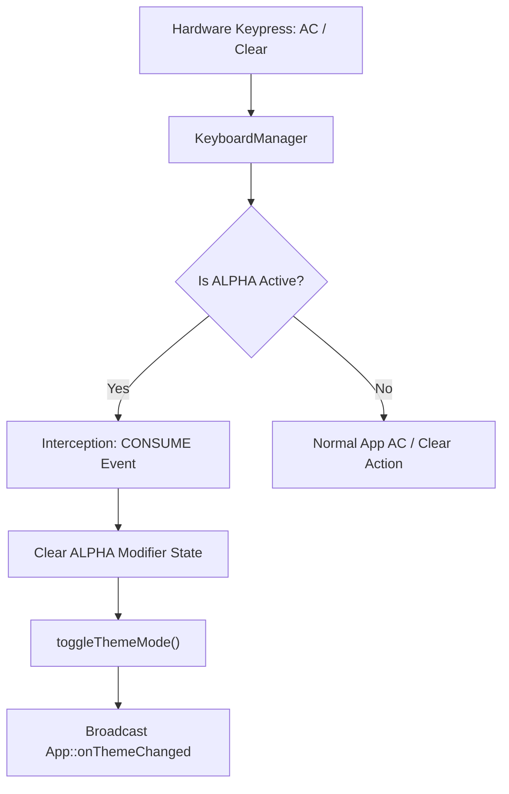
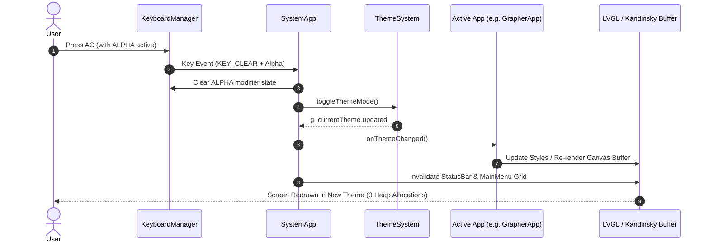

# High-Level Plan: Global Theme Switching (`AC && ALPHA` Key Event)

## 1. Executive Summary & Target Hardware Context

### Target Hardware Constraints (ESP32-S3-N16R8)
- **MCU**: ESP32-S3 Dual-Core Xtensa LX7 @ 240 MHz
- **Memory Setup**: 16 MB Octal SPI Flash, 8 MB Octal SPI PSRAM, ~512 KB Internal SRAM
- **Display**: 320 × 240 pixels RGB565 LCD (16-bit color depth per pixel)
- **Primary Memory Goal**: Theme transitions **MUST NOT allocate or deallocate dynamic heap/PSRAM** memory during runtime. All palette definitions must be statically allocated or constant lookups. Canvas buffer invalidation must re-use existing PSRAM allocations (`uint16_t* _graphBuf`).

### Feature Goal
Implement a system-wide theme switch triggered by the hardware key chord **`AC && ALPHA`** (pressing the `AC` / `Clear` key while the `ALPHA` modifier phase is active). Switching toggles between two global visual themes:
1. **`CLASSIC`**: NumWorks-inspired light aesthetic (Cream/White background `#FFFFFF`, black text `#000000`, orange/amber primary accents `#FF9500`).
2. **`DEFAULT`**: Modern dark high-contrast aesthetic (Dark background `#1A1A1A`, light text `#CCCCCC`, cyan/blue primary accents `#0074D9` / `#00BCD4`).

---

## 2. Global Theme Architecture & Key Event Interception

### 2.1 Theme Representation (`src/ui/Theme.h`)
The global theme state is managed via an `enum class` stored as a single byte:

```cpp
enum class ThemeMode : uint8_t {
    CLASSIC = 0, // Light / NumWorks aesthetic
    DEFAULT = 1  // Dark / Modern aesthetic
};

extern ThemeMode g_currentTheme;

struct ThemePalette {
    uint16_t bg;           // Screen/Canvas background
    uint16_t text;         // Primary body text
    uint16_t textMuted;    // Subtitles, secondary text
    uint16_t statusBg;     // 24px top status bar background
    uint16_t statusText;   // Status bar icons & clock text
    uint16_t cardBg;       // Launcher card background
    uint16_t cardBorder;   // Card outline/border
    uint16_t accent;       // Highlights & selection bounds
    uint16_t gridLines;    // Math/Graph grid line color
    uint16_t axisLines;    // Graph X/Y axis line color
};

const ThemePalette& getThemePalette();
void setThemeMode(ThemeMode mode);
void toggleThemeMode();
```

### 2.2 Key Event Handling (`AC && ALPHA`)
Key events flow through `KeyboardManager` into `SystemApp::handleGlobalKeyEvent()`.



#### Code Side Interception:
1. When `KeyEvent` with `KeyCode::KEY_CLEAR` or `KEY_AC` is dispatched:
2. Query `KeyboardManager::instance().isAlpha()`.
3. If `true`:
   - Consume event (do not pass `AC` clear action to the focused text box or calculator evaluator).
   - Clear `ALPHA` state via `KeyboardManager::instance().clearModifiers()`.
   - Call `toggleThemeMode()`.
   - Invoke `SystemApp::instance().notifyThemeChanged()`.

---

## 3. Screen & LVGL Design System

### 3.1 Design Side: UI Color Palettes

| Element | `CLASSIC` Theme (Light) | `DEFAULT` Theme (Dark) |
| :--- | :--- | :--- |
| **Screen Background** | `#FFFFFF` (Pure White) | `#1A1A1A` (Dark Grey) |
| **Status Bar (24px)** | `#FF9900` (NumWorks Orange) | `#121212` (Deep Charcoal) |
| **Status Text / Clock**| `#FFFFFF` (White) | `#00BCD4` (Cyan Accent) |
| **Primary Text / Labels**| `#000000` (Black) | `#E0E0E0` (Off-white) |
| **Card / Panel Background**| `#F5F5F5` (Light Off-white)| `#262626` (Mid Dark) |
| **Focused Card Border**| `#0074D9` (Vivid Blue) | `#FF9800` (Amber Gold) |
| **Math Grid / Graph Lines**| `#E0E0E0` (Subtle Grey) | `#333333` (Subtle Charcoal) |
| **Math Axes (X/Y)** | `#333333` (Dark Charcoal) | `#888888` (Light Grey) |

### 3.2 Code Side: Memory-Efficient LVGL Invalidation
- **No Widget Re-creation**: Avoid destroying `lv_obj_t` objects or re-instantiating layouts on theme switch.
- **LVGL Style Refresh**: Call `lv_obj_report_style_refresh()` on top-level screens (`lv_screen_active()`).
- **Global Status Bar & Launcher Invalidation**:
  - `StatusBar`: Update background color style and label text colors directly.
  - `MainMenu`: Trigger `lv_obj_invalidate(_grid)` to redraw the dot-grid pattern (`onGridDraw`) using `palette.gridLines`.
- **Kandinsky RGB565 Buffers (PSRAM)**:
  - For direct pixel rendering apps (`GrapherApp`, `CircuitCoreApp`, `Fluid2DApp`, etc.), call `clearBuffer()` with the new `palette.bg`, re-render axes/grids with `palette.gridLines` and `palette.axisLines`, and invalidate the LVGL canvas container.

---

## 4. Per-App Implementation Plan (`/src/apps`)

Each app will inherit or implement an `onThemeChanged()` lifecycle method invoked when `toggleThemeMode()` occurs.

```cpp
class App {
public:
    virtual void onThemeChanged() {}
};
```

---

### App 1: `CalculationApp` (Calculation)
- **UI Type**: LVGL `MathCanvas` (VPAM engine AST rendering) + Calculation History List.
- **Design Side**:
  - `CLASSIC`: White background, black VPAM math text, grey history separator lines.
  - `DEFAULT`: Dark background, light-grey VPAM math text (`#E0E0E0`), dark history separators.
- **Code Side**:
  - Call `_mathCanvas.setTheme(palette)` or update canvas base text color.
  - Invalidate calculation history LVGL list container.
  - Trigger `_mathCanvas.invalidate()`.

---

### App 2: `GrapherApp` (Grapher)
- **UI Type**: Kandinsky PSRAM RGB565 Buffer (`320x160` pixel canvas) + LVGL Function List/Tab View.
- **Design Side**:
  - `CLASSIC`: White plot background, light-grey square grid (`#E0E0E0`), dark axes (`#333333`), vibrant function curve colors (Blue, Red, Green).
  - `DEFAULT`: Dark plot background (`#1A1A1A`), dark-grey grid (`#333333`), light axes (`#A0A0A0`), high-luminance curve colors (Cyan, Magenta, Bright Yellow).
- **Code Side**:
  - Re-evaluate grid and axis color values in `GraphView`.
  - Execute `_graphView.clearBuffer()`.
  - Re-rasterize grid, axes, function curves, integral stipples, and POI markers into `_graphBuf`.
  - Call `lv_obj_invalidate(_canvasObj)`.

---

### App 3: `EquationsApp` (Equations)
- **UI Type**: LVGL Table & Form Input Fields (Polynomial / System of Linear Equations solver).
- **Design Side**:
  - `CLASSIC`: Light input fields with thin borders, dark coefficients, blue selection highlights.
  - `DEFAULT`: Dark input fields (`#2A2A2A`), white text, orange focus selection highlights.
- **Code Side**:
  - Update styles on parameter inputs and result card widgets via `lv_obj_add_style`.
  - Refresh `MathCanvas` formula display instances.

---

### App 4: `CalculusApp` (Calculus)
- **UI Type**: Compound LVGL view with sub-tabs for Derivative, Integral, Limit, and Taylor Series.
- **Design Side**:
  - Adapt background and card colors for sub-tabs to match active theme palette.
- **Code Side**:
  - Propagate `onThemeChanged()` to active sub-tab view.
  - Invalidate MathCanvas widgets rendering mathematical expressions.

---

### App 5: `StatisticsApp` (Statistics)
- **UI Type**: LVGL Data Table (V1/N1 columns) + Kandinsky Histogram/Boxplot Canvas.
- **Design Side**:
  - `CLASSIC`: White table grid, black data numbers, light blue histogram bar fills.
  - `DEFAULT`: Dark table grid (`#222222`), white numbers, cyan histogram bar fills with dark outlines.
- **Code Side**:
  - Refresh LVGL table styles.
  - Re-draw statistical chart canvas in PSRAM buffer with new background & fill colors.

---

### App 6: `ProbabilityApp` (Probability)
- **UI Type**: Distribution Selector List + Shaded Density Curve Canvas (Normal, Binomial, Student-t, etc.).
- **Design Side**:
  - `CLASSIC`: White plot area, dark distribution curve, light red/blue tail area shading.
  - `DEFAULT`: Dark plot area, bright yellow/cyan curve, semi-transparent dark-purple/teal tail shading.
- **Code Side**:
  - Clear and re-render probability curve canvas buffer using updated `ThemePalette` colors.

---

### App 7: `RegressionApp` (Regression)
- **UI Type**: Data Input Table + Scatter Plot / Fitted Curve Canvas.
- **Design Side**:
  - `CLASSIC`: Light scatter background, dark scatter dots, red trend line.
  - `DEFAULT`: Dark scatter background, glowing yellow scatter dots, neon-pink trend line.
- **Code Side**:
  - Re-render scatter points and regression model curve to PSRAM canvas buffer.

---

### App 8: `SequencesApp` (Sequences)
- **UI Type**: Sequence Input Form ($u_{n+1}$, $v_{n+1}$) + Table of Values + Web Plot Plotter.
- **Design Side**:
  - `CLASSIC`: White table rows, blue/green cobweb plot lines.
  - `DEFAULT`: Dark table rows, neon green/cyan cobweb plot lines.
- **Code Side**:
  - Refresh LVGL sequence table rows.
  - Redraw web plot canvas.

---

### App 9: `PythonApp` (Python)
- **UI Type**: MicroPython REPL Terminal & Script Editor.
- **Design Side**:
  - `CLASSIC`: Classic Light IDE — Cream background (`#FAFAFA`), dark navy text, green prompt (`>>>`).
  - `DEFAULT`: Modern Dark Console — Pitch black background (`#000000`), white/lime text (`#00FF00`), cyan prompt.
- **Code Side**:
  - Redraw console text canvas or update LVGL text area font/bg colors.

---

### App 10: `MatricesApp` (Matrices)
- **UI Type**: Matrix Grid Editor (Cells `[A]`, `[B]`) & Linear Algebra Result Viewer.
- **Design Side**:
  - `CLASSIC`: White matrix cells with black brackets `[` `]`, dark values.
  - `DEFAULT`: Dark grey matrix cells with light grey brackets, white values.
- **Code Side**:
  - Update matrix grid component styles and trigger `lv_obj_invalidate()`.

---

### App 11: `SettingsApp` (Settings)
- **UI Type**: LVGL Menu List (Brightness slider, Angle Mode DEG/RAD, System Theme toggle switch).
- **Design Side**:
  - `CLASSIC`: White list items, blue active toggle state.
  - `DEFAULT`: Dark grey list items, orange active toggle state.
- **Code Side**:
  - Synchronize Theme Switch toggle widget in Settings to reflect new `g_currentTheme`.
  - Update list container styles.

---

### App 12: `PeriodicTableApp` (Chemistry)
- **UI Type**: Interactive 118-Element Periodic Grid + Element Detail Card + ChemCAS.
- **Design Side**:
  - `CLASSIC`: Standard IUPAC element colors on light background, dark element symbols.
  - `DEFAULT`: High-contrast element blocks on dark background, glowing element symbols.
- **Code Side**:
  - Invalidate periodic grid container.
  - Update ChemCAS formula MathCanvas widget styles.

---

### App 13: `BridgeDesignerApp` (Bridge)
- **UI Type**: 2D Structural Truss Bridge Canvas (Kandinsky PSRAM buffer) + Node/Member Editor.
- **Design Side**:
  - `CLASSIC`: White background, blue compression members, red tension members, brown joints.
  - `DEFAULT`: Blueprint / Dark mode — Deep navy/dark background (`#0F172A`), bright cyan compression, bright orange tension, white joints.
- **Code Side**:
  - Re-render bridge simulation buffer with updated color lookup table.

---

### App 14: `CircuitCoreApp` (Circuit)
- **UI Type**: Schematic Grid Canvas + MNA Component Palette.
- **Design Side**:
  - `CLASSIC`: White paper schematic grid, dark green wire traces, black component symbols (resistors, caps, inductors).
  - `DEFAULT`: Dark EDA / CAD mode — Dark background (`#121212`), bright green wire traces, yellow component symbols.
- **Code Side**:
  - Re-rasterize schematic grid and components into PSRAM buffer.

---

### App 15: `Fluid2DApp` (Fluid 2D)
- **UI Type**: Real-time Eulerian Navier-Stokes Fluid Solver Canvas.
- **Design Side**:
  - `CLASSIC`: Light background, smoke/velocity vectors rendered in dark blue gradient.
  - `DEFAULT`: Dark background, fluid density rendered in fiery neon / rainbow heat-map palette.
- **Code Side**:
  - Swap fluid color palette lookup array (flash/SRAM table) used during frame rendering.

---

### App 16: `ParticleLabApp` (ParticleLab)
- **UI Type**: N-Body Physics Particle Canvas (Gravity & Electrostatics).
- **Design Side**:
  - `CLASSIC`: White background, dark particle dots with fading grey motion trails.
  - `DEFAULT`: Deep space dark background, glowing energetic particles with neon trails.
- **Code Side**:
  - Clear particle canvas buffer with new background color; step particle renderer.

---

### App 17: `NeuralLabApp` (Neural Lab)
- **UI Type**: Neural Network Architecture Graph + Loss Curve Plotter + 2D Decision Boundary Canvas.
- **Design Side**:
  - `CLASSIC`: Light network node circles, dark connections, light decision boundary shading.
  - `DEFAULT`: Dark network node circles, glowing cyan/magenta connections, high-contrast decision boundary.
- **Code Side**:
  - Re-render network architecture and decision boundary canvas buffers.

---

### App 18: `OpticsLabApp` (OpticsLab)
- **UI Type**: Ray Optics Simulation Canvas (Lenses, Mirrors, Prisms).
- **Design Side**:
  - `CLASSIC`: White background, dark glass lens profiles, bright red laser ray paths.
  - `DEFAULT`: Optical bench dark mode — Dark background, cyan/glass lens outlines, glowing neon red/green laser rays.
- **Code Side**:
  - Re-draw optics simulation canvas buffer.

---

### App 19: `NeoLanguageApp` (NeoLang)
- **UI Type**: Code Editor + Interactive Output Terminal + AST Visualizer.
- **Design Side**:
  - `CLASSIC`: Light editor background, classic syntax highlighting (blue keywords, red strings, green comments).
  - `DEFAULT`: Dark IDE theme (Monokai / Dark+ palette: purple keywords, yellow strings, grey comments).
- **Code Side**:
  - Update syntax highlighter color map and refresh editor text view.

---

### App 20: `FractalApp` (Fractal)
- **UI Type**: Real-time Mandelbrot & Julia Set Explorer (PSRAM RGB565 Canvas).
- **Design Side**:
  - `CLASSIC`: Light-oriented palette (White interior set, pastel outer rings).
  - `DEFAULT`: Classic Dark / Electric palette (Black interior set, fiery psychedelic outer rings).
- **Code Side**:
  - Swap active color map lookup array and flag canvas for full redraw.

---

### App 21: `MathRenderVisualTestApp` (Math Visual)
- **UI Type**: MathCanvas rendering benchmark & visual validation screen.
- **Design Side**:
  - Toggle canvas background between white (`CLASSIC`) and dark (`DEFAULT`).
- **Code Side**:
  - Call `setMathStyle()` / `invalidate()` on test MathCanvas instances.

---

### App 22: `IntegralApp` (Integral)
- **UI Type**: Definite/Indefinite Step-by-Step Integrator.
- **Design Side**:
  - Update VPAM MathCanvas expressions and step-by-step resolution card backgrounds.
- **Code Side**:
  - Invalidate MathCanvas and card containers.

---

### App 23: `TutorApp` (Tutor)
- **UI Type**: Interactive Math Problem Tutor (Step guidance, Hint boxes, Input area).
- **Design Side**:
  - `CLASSIC`: Soft light green/blue hint boxes on white background.
  - `DEFAULT`: Dark grey hint boxes with glowing green/amber borders on dark background.
- **Code Side**:
  - Refresh LVGL styles for tutor card containers and hint labels.

---

## 5. Architectural Summary & Verification Plan



### 5.1 ESP32-S3 Memory & Performance Guardrails
1. **Zero Allocation Constraint**: Verification tests must assert `heap_caps_get_free_size(MALLOC_CAP_8BIT)` before and after `toggleThemeMode()` to guarantee 0 bytes allocated during theme switching.
2. **PSRAM Buffer Preservation**: The Kandinsky graphics buffer (`uint16_t* _graphBuf`) is allocated once during app initialization and NEVER freed/re-allocated during theme switches.
3. **Execution Latency**: Theme switch redraw must complete within **1 to 2 display frames** (<33 ms) to maintain 30+ FPS interactive feel.

---

## 6. Implementation Checklist & Action Items

- [ ] **Phase 1: Global Theme Engine**
  - Add `ThemeMode g_currentTheme` and `ThemePalette` lookup in `src/ui/Theme.h` / `Theme.cpp`.
- [ ] **Phase 2: Input Interception**
  - Update `SystemApp::handleGlobalKeyEvent` to catch `KEY_CLEAR` + `isAlpha()`.
- [ ] **Phase 3: System UI Elements**
  - Implement `StatusBar::onThemeChanged()` and `MainMenu::onThemeChanged()`.
- [ ] **Phase 4: App Integration**
  - Add `virtual void App::onThemeChanged()` base method.
  - Implement `onThemeChanged()` across all **23 unique apps** in `/src/apps`.
- [ ] **Phase 5: ESP32-S3 Hardware Validation**
  - Run build verification with PlatformIO: `pio run -e esp32s3_n16r8`.
  - Validate zero heap allocation during theme toggling on hardware/emulator.

---

## 7. Detailed Code Blueprint & Non-Destructive Event Handler

### 7.1 Key Event Listener Function Signature
Key events are polled in `SystemApp::update()` and routed to:

```cpp
// In src/SystemApp.cpp
void SystemApp::handleKey(const KeyEvent &rawEvent);
```

### 7.2 Non-Destructive Key Interception Pattern (`AC && ALPHA`)
Inside `SystemApp::handleKey()`, the `ALPHA + AC` key combination is intercepted at the top of the system handler:

```cpp
void SystemApp::handleKey(const KeyEvent &rawEvent) {
    if (rawEvent.action != KeyAction::PRESS && rawEvent.action != KeyAction::REPEAT) {
        return;
    }
    KeyEvent ev = rawEvent;

    auto& km = vpam::KeyboardManager::instance();

    // ── ALPHA + AC → Non-destructive Global Theme Switch ──
    if (km.isAlpha() && (ev.code == KeyCode::AC || ev.code == KeyCode::KEY_CLEAR)) {
        km.reset();            // Reset modifier phase so ALPHA does not linger
        _alphaActive = false;  // Clear local alpha flag
        
        toggleThemeMode();     // Toggle g_currentTheme (CLASSIC <-> DEFAULT)
        notifyThemeChanged();  // Refresh active screen & system status bar
        return;                // CONSUME event: prevents clearing text/AST
    }

    // ... Existing HOME, BACK, SHIFT+AC system shortcuts continue unchanged ...
}
```

### 7.3 Non-Destructive Component Implementation (`if (mode == CLASSIC) { ... } else { /* ORIGINAL UI */ }`)

#### Pattern A: Global Theme Check Helper (`src/ui/Theme.h`)
```cpp
enum class ThemeMode : uint8_t {
    DEFAULT = 0,  // Original Dark / Modern UI
    CLASSIC = 1   // Classic Light / NumWorks UI
};

extern ThemeMode g_currentTheme;

inline bool isClassicTheme() { return g_currentTheme == ThemeMode::CLASSIC; }
```

#### Pattern B: LVGL Screen Styling ([`src/ui/MainMenu.cpp`](file:///home/fih/musings/AbsolutOS/src/ui/MainMenu.cpp))
```cpp
void MainMenu::applyThemeStyles() {
    if (isClassicTheme()) {
        // [CLASSIC MODE] Light cream background, dark grid dots, blue focus border
        lv_obj_set_style_bg_color(_screen, lv_color_hex(0xFFFFFF), 0);
        lv_obj_set_style_border_color(_styleCardFocused, lv_color_hex(0x0074D9), 0);
    } else {
        // [ORIGINAL UI] Preserved 100% untouched
        lv_obj_set_style_bg_color(_screen, lv_color_hex(0x1A1A1A), 0);
        lv_obj_set_style_border_color(_styleCardFocused, lv_color_hex(0xFF9800), 0);
    }
}
```

#### Pattern C: Status Bar Styling ([`src/ui/StatusBar.cpp`](file:///home/fih/musings/AbsolutOS/src/ui/StatusBar.cpp))
```cpp
void StatusBar::applyTheme() {
    if (isClassicTheme()) {
        // [CLASSIC MODE] NumWorks Orange header
        lv_obj_set_style_bg_color(_bar, lv_color_hex(0xFF9900), 0);
        lv_obj_set_style_text_color(_titleLabel, lv_color_hex(0xFFFFFF), 0);
    } else {
        // [ORIGINAL UI] Dark charcoal header
        lv_obj_set_style_bg_color(_bar, lv_color_hex(0x1A1A1A), 0);
        lv_obj_set_style_text_color(_titleLabel, lv_color_hex(0xCCCCCC), 0);
    }
}
```

#### Pattern D: Kandinsky PSRAM Canvas ([`src/ui/GraphView.cpp`](file:///home/fih/musings/AbsolutOS/src/ui/GraphView.cpp))
```cpp
void GraphView::drawGridAndAxes() {
    uint16_t bgColor;
    uint16_t gridColor;
    uint16_t axisColor;

    if (isClassicTheme()) {
        // [CLASSIC MODE] Light canvas background
        bgColor   = utils::rgb888to565(0xFFFFFF);
        gridColor = utils::rgb888to565(0xE0E0E0);
        axisColor = utils::rgb888to565(0x333333);
    } else {
        // [ORIGINAL UI] Original dark canvas background
        bgColor   = utils::rgb888to565(0x1A1A1A);
        gridColor = utils::rgb888to565(0x333333);
        axisColor = utils::rgb888to565(0x888888);
    }

    clearBuffer(bgColor);
    drawGridWithColor(gridColor);
    drawAxesWithColor(axisColor);
}
```

---

## 8. Agent Implementation Specification & State Encapsulation

> [!IMPORTANT]
> **Core Architectural Directive for Coding Agents**:
> The `CLASSIC` theme is **PURELY ADDITIVE** and exists strictly as an **alternative visual layer** alongside the existing `DEFAULT` UI. 
> - **DO NOT** delete, overwrite, or refactor out existing default UI code, color constants, or layout definitions.
> - The `DEFAULT` UI path MUST remain 100% intact inside the `else` branch of every theme check.
> - If `isClassicTheme()` returns `false`, the codebase MUST execute its exact original, unmodified UI rendering logic.

### 8.1 State Encapsulation vs Raw Global Variable

Coding agents implementing this feature MUST use the encapsulated helper function `isClassicTheme()` rather than directly exposing/mutating a naked global variable.

#### Rationale for AI Coding Agents:
1. **Prevents UI Desynchronization Bugs**: Modifying a raw variable (`g_theme = ThemeMode::CLASSIC;`) fails to trigger screen invalidation callbacks. Passing through `setThemeMode()` or `toggleThemeMode()` guarantees that `SystemApp::notifyThemeChanged()` is automatically called to refresh LVGL objects and Kandinsky PSRAM buffers.
2. **Zero Performance Overhead**: `inline bool isClassicTheme()` compiles down to a single byte load on the ESP32-S3 Xtensa core.
3. **Consistent Code Pattern**: Standardizes conditional checks across all 23 apps under a uniform, readable API.

### 8.2 Canonical Agent Interface Contract ([`src/ui/Theme.h`](file:///home/fih/musings/AbsolutOS/src/ui/Theme.h) & [`src/ui/Theme.cpp`](file:///home/fih/musings/AbsolutOS/src/ui/Theme.cpp))

#### Header Definition (`src/ui/Theme.h`):
```cpp
enum class ThemeMode : uint8_t {
    DEFAULT = 0,  // Original Dark / Modern UI (Default)
    CLASSIC = 1   // Additive Light / NumWorks UI (Alternative)
};

// ── State Read Contract ──
ThemeMode getThemeMode();
inline bool isClassicTheme() { return getThemeMode() == ThemeMode::CLASSIC; }

// ── State Mutation Contract (Auto-notifies System & Views) ──
void setThemeMode(ThemeMode mode);
void toggleThemeMode();
```

#### Implementation Definition (`src/ui/Theme.cpp`):
```cpp
// Encapsulated static state (hidden from external direct mutation)
static ThemeMode s_currentTheme = ThemeMode::DEFAULT;

ThemeMode getThemeMode() {
    return s_currentTheme;
}

void setThemeMode(ThemeMode mode) {
    if (s_currentTheme == mode) return; // Prevent duplicate work
    s_currentTheme = mode;
    
    // Automatically trigger system-wide screen & canvas refresh
    SystemApp::instance().notifyThemeChanged();
}

void toggleThemeMode() {
    setThemeMode(s_currentTheme == ThemeMode::CLASSIC ? ThemeMode::DEFAULT : ThemeMode::CLASSIC);
}
```

### 8.3 Standard Additive Implementation Template for App Developers & Agents

When implementing theme support in any app under `/src/apps`, follow this exact template:

```cpp
void ExampleApp::renderUI() {
    if (isClassicTheme()) {
        // ── ADDITIVE: Classic Light UI Customizations ──
        applyClassicColorPalette();
        drawClassicGrid();
    } else {
        // ── ORIGINAL: Unmodified Default UI Path (Intact) ──
        applyOriginalColorPalette();
        drawOriginalGrid();
    }
}
```

---

## 9. Designer Export Guidelines & Seamless Integration Specification

To ensure that UI designers can export their theme design files into the codebase in a way that an AI agent or human developer can integrate 100% seamlessly without breaking existing logic, follow this export specification.

### 9.1 File Location & Naming Convention
The designer should package all theme assets, color palettes, and LVGL style definitions into a dedicated, self-contained module directory:

```
src/
└── ui/
    └── theme/
        ├── ClassicTheme.h      <-- Public palette constants & style declarations
        └── ClassicTheme.cpp    <-- LVGL style definitions & color lookup arrays
```

---

### 9.2 Header Export Structure (`src/ui/theme/ClassicTheme.h`)

The designer exports a single, clean header with a dedicated namespace (`ui::classic`):

```cpp
#pragma once
#include <stdint.h>
#include <lvgl.h>

namespace ui::classic {

// ── 1. RGB565 & LVGL Palette Colors ──
constexpr uint16_t COLOR_BG              = 0xFFFF; // Pure White
constexpr uint16_t COLOR_TEXT_PRIMARY    = 0x0000; // Black
constexpr uint16_t COLOR_TEXT_MUTED      = 0x5555; // Mid Grey
constexpr uint16_t COLOR_STATUSBAR_BG    = 0xFD60; // NumWorks Orange (#FF9900)
constexpr uint16_t COLOR_STATUSBAR_TEXT  = 0xFFFF; // White
constexpr uint16_t COLOR_CARD_BG         = 0xF7BE; // Light Off-White (#F5F5F5)
constexpr uint16_t COLOR_CARD_BORDER     = 0xE71C; // Subtle Grey Border
constexpr uint16_t COLOR_ACCENT_FOCUS    = 0x03B7; // Vivid Blue Focus (#0074D9)
constexpr uint16_t COLOR_GRID_LINES      = 0xE71C; // Light Grey Math Grid
constexpr uint16_t COLOR_AXIS_LINES      = 0x31A6; // Dark Charcoal Graph Axes

// ── 2. Reusable LVGL Static Styles (Initialized once) ──
extern lv_style_t style_screen;
extern lv_style_t style_statusbar;
extern lv_style_t style_card_normal;
extern lv_style_t style_card_focused;
extern lv_style_t style_input_box;
extern lv_style_t style_button;

// ── 3. Special App Color Lookup Tables (PSRAM / Canvas Apps) ──
extern const uint16_t kFluidHeatmapPalette[256];  // Fluid2DApp density gradient
extern const uint32_t kFractalColorMap[128];       // FractalApp Julia/Mandelbrot palette
struct CircuitColors { uint16_t wire; uint16_t resistor; uint16_t cap; };
extern const CircuitColors kCircuitPalette;
struct BridgeColors { uint16_t compression; uint16_t tension; uint16_t joint; };
extern const BridgeColors kBridgePalette;

// ── 4. One-Time Style Initializer ──
void initClassicTheme();

} // namespace ui::classic
```

---

### 9.3 Implementation Export Structure (`src/ui/theme/ClassicTheme.cpp`)

The designer implements the initialization function and static style configurations:

```cpp
#include "ClassicTheme.h"

namespace ui::classic {

lv_style_t style_screen;
lv_style_t style_statusbar;
lv_style_t style_card_normal;
lv_style_t style_card_focused;
lv_style_t style_input_box;
lv_style_t style_button;

void initClassicTheme() {
    static bool initialized = false;
    if (initialized) return;
    initialized = true;

    // Screen style
    lv_style_init(&style_screen);
    lv_style_set_bg_color(&style_screen, lv_color_hex(0xFFFFFF));

    // Status bar style
    lv_style_init(&style_statusbar);
    lv_style_set_bg_color(&style_statusbar, lv_color_hex(0xFF9900));
    lv_style_set_text_color(&style_statusbar, lv_color_hex(0xFFFFFF));

    // Card normal style
    lv_style_init(&style_card_normal);
    lv_style_set_bg_color(&style_card_normal, lv_color_hex(0xF5F5F5));
    lv_style_set_border_color(&style_card_normal, lv_color_hex(0xE0E0E0));
    lv_style_set_border_width(&style_card_normal, 1);

    // Card focused style (Blue outline)
    lv_style_init(&style_card_focused);
    lv_style_set_border_color(&style_card_focused, lv_color_hex(0x0074D9));
    lv_style_set_border_width(&style_card_focused, 2);
}

} // namespace ui::classic
```

---

### 9.4 Seamless Integration Steps for AI Agents & Developers

When a designer provides `ClassicTheme.h` and `ClassicTheme.cpp`, an AI agent or developer can integrate it into the codebase in **3 simple, non-destructive steps**:

#### Step 1: Include `ClassicTheme.h` in [`src/ui/Theme.h`](file:///home/fih/musings/AbsolutOS/src/ui/Theme.h)
```cpp
#include "theme/ClassicTheme.h"
```

#### Step 2: Initialize Theme Styles in [`src/ui/Theme.cpp`](file:///home/fih/musings/AbsolutOS/src/ui/Theme.cpp)
```cpp
void initThemeSystem() {
    ui::classic::initClassicTheme();
}
```

#### Step 3: Consume Theme Constants in Any App or Widget
- **For LVGL Widgets**:
  ```cpp
  if (isClassicTheme()) {
      lv_obj_add_style(cardObj, &ui::classic::style_card_focused, LV_STATE_FOCUSED);
  } else {
      // Default UI path (Intact)
      lv_obj_add_style(cardObj, &_styleCardFocused, LV_STATE_FOCUSED);
  }
  ```
- **For Kandinsky PSRAM Canvas Buffers**:
  ```cpp
  if (isClassicTheme()) {
      _view.setGridColors(ui::classic::COLOR_GRID_LINES, ui::classic::COLOR_AXIS_LINES);
  } else {
      // Default UI path (Intact)
      _view.setGridColors(0x3333, 0x8888);
  }
  ```

---

### 9.5 Summary of Designer-to-Agent Handoff Protocol

1. **Self-Contained Module**: The designer dumps code strictly into `src/ui/theme/ClassicTheme.h` and `.cpp`.
2. **Zero Invasiveness**: The designer never modifies existing app source files directly.
3. **Agent Integration Efficiency**: The AI agent reads `ClassicTheme.h` and wires the constants into the `if (isClassicTheme())` branches across `/src/apps` with 100% type safety and zero risk of breaking default UI rendering.

---

## 10. Designer Export Guidelines for Custom Non-LVGL Renderers (VPAM & Kandinsky)

Custom non-LVGL apps in AbsolutOS do not use standard LVGL widgets (`lv_btn`, `lv_label`, etc.). Instead, they use low-level custom renderers:
1. **`MathCanvas`** ([`src/ui/MathRenderer.h`](file:///home/fih/musings/AbsolutOS/src/ui/MathRenderer.h)): Custom AST math equation renderer used by **CalculationApp**, **CalculusApp**, **EquationsApp**, **IntegralApp**, and **TutorApp**.
2. **`GraphView`** ([`src/ui/GraphView.h`](file:///home/fih/musings/AbsolutOS/src/ui/GraphView.h)): Kandinsky direct-to-memory RGB565 PSRAM pixel engine used by **GrapherApp**, **CalculusApp**, **RegressionApp**, and **SequencesApp**.

Here is how the designer exports theme configs for these custom renderers so agents/devs can plug them in seamlessly.

---

### 10.1 VPAM `MathCanvas` Color Theme Export Structure

The designer defines a `MathCanvasThemeConfig` struct in [`src/ui/theme/ClassicTheme.h`](file:///home/fih/musings/AbsolutOS/src/ui/theme/ClassicTheme.h):

```cpp
namespace ui::classic {

struct MathCanvasThemeConfig {
    uint32_t textInkColor;        // Main equation text & digits (0x000000 black vs 0xE0E0E0 white)
    uint32_t placeholderColor;    // NodeEmpty box outline (0xB0B0B0 light grey vs 0x444444 dark grey)
    uint32_t cursorColor;         // Blinking edit cursor (0x000000 black vs 0x00BCD4 cyan)
    uint32_t fractionBarColor;    // Fraction bar line (0x000000 black vs 0xCCCCCC light grey)
    uint32_t radicalStrokeColor;  // Square root √ overline & hook (0x000000 black vs 0xCCCCCC)
    uint32_t stepHighlightColor;  // Smart highlighter intermediate step (0x1565C0 blue vs 0x64B5F6 cyan)
    uint32_t resultHighlightColor;// Smart highlighter final result (0xE05500 orange vs 0xFFB74D amber)
};

extern const MathCanvasThemeConfig kClassicMathCanvasTheme;

} // namespace ui::classic
```

#### How the Agent/Dev Integrates It in `MathRenderer.cpp`:
Inside `MathCanvas::onDraw(lv_event_t* e)`:

```cpp
// Non-destructive theme selection
const auto& mathColors = isClassicTheme() ? ui::classic::kClassicMathCanvasTheme 
                                          : kDefaultMathCanvasTheme;

// Use mathColors.textInkColor, mathColors.cursorColor, etc., during AST recursive drawing
```

---

### 10.2 Kandinsky `GraphView` Color Theme Export Structure

The designer defines a `GraphViewThemeConfig` struct in [`src/ui/theme/ClassicTheme.h`](file:///home/fih/musings/AbsolutOS/src/ui/theme/ClassicTheme.h):

```cpp
namespace ui::classic {

struct GraphViewThemeConfig {
    uint16_t canvasBgRGB565;      // PSRAM clear color (0xFFFF white vs 0x1A1A dark charcoal)
    uint16_t gridLinesRGB565;     // Square grid lines (0xE0E0 light grey vs 0x3333 dark grey)
    uint16_t axisLinesRGB565;     // X/Y axes (0x3333 dark charcoal vs 0x8888 light grey)
    uint32_t functionCurves[6];   // High-contrast curve palette: [0]=Blue, [1]=Red, [2]=Green, etc.
    uint32_t integralStippleColor;// Area-under-curve fill color
    uint32_t tangentLineColor;    // Tangent slope line color
    uint32_t poiMarkerColor;      // Intersection / root marker circle color
};

extern const GraphViewThemeConfig kClassicGraphViewTheme;

} // namespace ui::classic
```

#### How the Agent/Dev Integrates It in `GraphView.cpp`:
Inside `GraphView::redrawGridAndAxes()`:

```cpp
// Non-destructive canvas background & grid setup
if (isClassicTheme()) {
    const auto& theme = ui::classic::kClassicGraphViewTheme;
    clearBuffer(theme.canvasBgRGB565);
    drawGridWithColor(theme.gridLinesRGB565);
    drawAxesWithColor(theme.axisLinesRGB565);
} else {
    // Original Kandinsky dark grid path (Intact)
    clearBuffer(0x1A1A);
    drawGridWithColor(0x3333);
    drawAxesWithColor(0x8888);
}
```

---

### 10.3 CalculusApp & Multi-Engine Integration

In `CalculusApp` (which displays both VPAM math formulas via `MathCanvas` and derivative/integral tangent plots via `GraphView`):

```cpp
void CalculusApp::onThemeChanged() {
    // 1. Refresh MathCanvas AST expressions
    if (_mathCanvas) {
        _mathCanvas->invalidate(); // Re-runs onDraw with active theme ink colors
    }
    
    // 2. Refresh Kandinsky PSRAM plot canvas
    if (_graphView) {
        _graphView->redrawGridAndAxes();
        _graphView->reRenderCurves();
        lv_obj_invalidate(_canvasObj); // Flushes updated PSRAM buffer to screen
    }
}
```

---

### 10.4 Summary Table for Designer Handoff of Non-LVGL Renderers

| App Name | Custom Engine Used | Designer Export Struct | Key Color Properties Exported |
| :--- | :--- | :--- | :--- |
| **CalculationApp** | VPAM `MathCanvas` | `MathCanvasThemeConfig` | Text ink, placeholder boxes, blinking cursor |
| **CalculusApp** | `MathCanvas` + `GraphView` | Both Theme Configs | Equation ink, tangent line, area stipple |
| **GrapherApp** | Kandinsky `GraphView` | `GraphViewThemeConfig` | PSRAM background, grid lines, 6 curve colors |
| **EquationsApp** | VPAM `MathCanvas` + LVGL Form | `MathCanvasThemeConfig` | Formula ink, input box border, root markers |
| **RegressionApp**| `GraphView` + LVGL Table | `GraphViewThemeConfig` | Scatter dot color, trendline color |
| **SequencesApp** | `GraphView` + LVGL Table | `GraphViewThemeConfig` | Cobweb plot color, sequence step lines |


